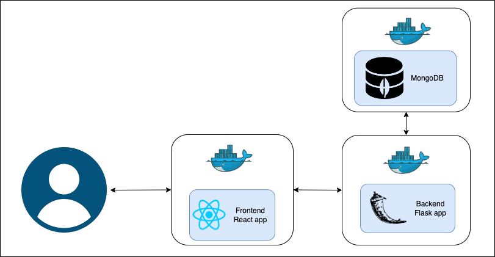
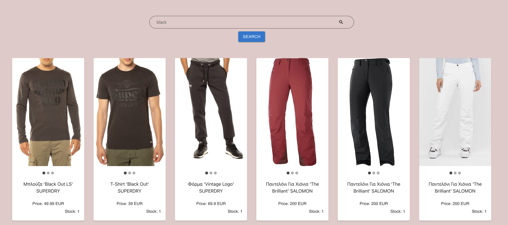

# Simple-React-flask-App

## Overview

Sample project that shows a single page from a store, where you can search for a product.
The applications that are used are :
-   MongoDB database
-   Python Flask for backend
-   React for frontend.

## Architecture


## Screenshot


## Setup

- Go to backnend/.env and setup absolute path of PYTHONPATH parameter
  (e.g /absolute-path-to-backend-folder)

- Then
```bash
    docker compose up
```